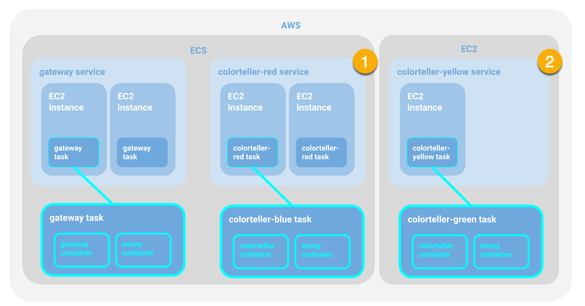

# Using AWS App Mesh with EC2

## Overview

In this article, I demonstrate running a service on EC2 and configuring to run with an existing ECS application, adding a route for the service using AWS App Mesh.


<p align="center"><b><i>Figure 2.</i></b> App Mesh configuration of the Color App.</p>

In previous articles I gave walkthroughs for running ECS and Fargate services for a demo application called the Color App using AWS App Mesh to control load balancing and routing (see [ECS walkthrough], [Fargate walkthrough]), so in this article I will just highlight the additional steps for adding the another version of this service that will run on an EC2 instance.

If you haven't read the previous articles, you should at least start with the [ECS walkthrough] first and ensure you have the application up and running. Once you are able to query for colors ([initially load balanced equally between a few colors](https://github.com/aws/aws-app-mesh-examples/blob/master/examples/apps/colorapp/servicemesh/appmesh-colorapp.yaml#L127-L132), then you'll be ready to follow along with this walkthrough.

## Prerequisites

1. You have successfully set up the prerequisites and deployed the Color App as described in the previous [ECS walkthrough].

## Deploy

In a clone of the [repo], ensure your shell is updated with the environment variables described in the [walkthrough].

As a reminder for the environment variables should look lie, here's what I'm using for the demo:

```
export AWS_PROFILE=default
export AWS_DEFAULT_REGION=us-west-1
export AWS_REGION=$AWS_DEFAULT_REGION
export ENVIRONMENT_NAME=demo
export MESH_NAME=colorapp
export SERVICES_DOMAIN=demo.local
export ENVOY_IMAGE=111345817488.dkr.ecr.us-west-2.amazonaws.com/aws-appmesh-envoy:v1.9.1.0-prod
export KEY_PAIR_NAME="YOUR IAM USER KEY PAIR"
```

### 1. Deploy the App Mesh configuration update

We will update the existing mesh for the application by adding support for a yellow colorteller.

In `walkthroughs/ec2/appmesh-colorapp.yaml`, we've added a resource for the virtual node (`ColorTellerYellowVirtualNode`) that will ultimately get mapped to a service that we'll run on our EC2 instance listening for HTTP requests on port 9080. This virtual node will be registered to be advertised for service discovery.

```
  ColorTellerYellowVirtualNode:
    Type: AWS::AppMesh::VirtualNode
    Properties:
      MeshName: colorapp
      VirtualNodeName: colorteller-yellow-vn
      Spec:
        Listeners:
          - PortMapping:
              Port: 9080
              Protocol: http
        ServiceDiscovery:
          DNS:
            Hostname: colorteller-yellow.demo.local
```

We also update the `ColorTellerRoute` resource so that our colorteller service will load balance color requests equally between the existing version of a service that responds with "red" and our new version of the service that responds with "yellow".

```
  ColorTellerRoute:
    Type: AWS::AppMesh::Route
    DependsOn:
      - ColorTellerYellowVirtualNode
      - ColorTellerRedVirtualNode
      ...
    Properties:
      MeshName: colorteller
      VirtualRouterName: colorteller-vr
      RouteName: colorteller-route
      Spec:
        HttpRoute:
          Action:
            WeightedTargets:
              - VirtualNode: colorteller-red-vn
                Weight: 1
              - VirtualNode: colorteller-yellow-vn
                Weight: 1
          Match:
            Prefix: "/"
```

To deploy the stack, run the `appmesh-colorapp.sh` helper script. This will use your environment to parameterize the CloudFormation stack template and run it. You can check the AWS CloudFormation console to confirm that `demo-appmesh-colorapp` has been updated successfully.

```
$ ./walkthroughs/ec2/appmesh-colorapp.sh
```

### 2. Deploy the colorteller service to EC2

After updating the colorapp mesh configuration, deploy the new infrastructure and run a colorteller service on it. The CloudFormation template is `walkthroughs/ec2/ec2-cluster.yaml` and the helper script to deploy the stack is `walkthroughs/ec2/ec2-cluster.sh`

```
$ ./walkthroughs/ec2/ec2-cluster.sh
```

### 3. Test the update

Get the app's public web endpoint and curl it a few times (or open it in a browser and refresh the page a few times).

```
$ colorapp=$(aws cloudformation describe-stacks --stack-name=$ENVIRONMENT_NAME-ecs-colorapp --query="Stacks[0].Outputs[?OutputKey=='ColorAppEndpoint'].OutputValue" --output=text) && echo $colorapp
http://demo-Publi-1JFQ3Z55JL3IF-72969551.us-west-1.elb.amazonaws.com

$ curl $colorapp/color
{"color":"yellow", "stats": {"yellow":1}}
$ curl $colorapp/color
{"color":"red", "stats": {"red":0.2,"yellow":0.8}}
$ curl $colorapp/color
{"color":"yellow", "stats": {"red":0.17,"yellow":0.83}}
$ curl $colorapp/color
{"color":"yellow", "stats": {"red":0.14,"yellow":0.86}}
$ curl $colorapp/color
{"color":"red", "stats": {"red":0.25,"yellow":0.75}}
```

Try running it in a loop for verifying the distribution approaches 50/50 over time:

```
$ for ((n=0;n<100;n++)); do echo "$n: $(curl -s $colorapp/color)"; done
...
99: {"color":"yellow", "stats": {"red":0.47,"yellow":0.53}}
```

Great, it works!

## How did this work?

You will want to examine the `EC2Instance` resource that we create in `ec2-cluster.yaml`, specifically the `UserData` section where we provide the script to configure the instance when it gets deployed. The significant details are the following:

* We install the Go toolchain, then use Go to get and compile our colorteller service (`github.com/aws/aws-app-mesh-examples/examples/apps/colorapp/src/colorteller/`), which we then move to `/usr/local/bin/colorteller` and start running. Once the app is running, you can ssh into the instance and curl it to verify the service is working locally.
* We install Docker and pull images for the Envoy proxy and for configuring iptables on the instance. Using Docker is not necessary if you want to install Envoy and the configuration script directly on the instance, but one of the benefits of using Docker is that it makes deploying processes easy. The only reason for not putting the colorteller service in a container was because we wanted to demonstrate that you can run plain old services on your EC2 instance and App Mesh will work with them. The proxy router manager script was containerized with the `walkthroughs/ec2/Dockerfile` and pushed to Docker Hub.
* We start Envoy and then we run the proxy router manager container that will configure iptables so that all instance ingress/egress network traffic will be routed through Envoy so that it can apply your App Mesh configuration rules.

## Summary

In this walkthrough, we demonstrated the flexibility of App Mesh in supporting un-containerized services that run directly on EC2 instances. Although we added this onto the existing ECS demo, many customers will benefit from the ability to use App Mesh to add routing support to existing EC2-based services as they migrate toward a microservices architecture and adopt managed services like ECS, EKS, and Fargate.

## Resources

[AWS App Mesh Documentation]

[AWS CLI]

[Color App]


[AWS App Mesh Documentation]: https://aws.amazon.com/app-mesh/getting-started/
[AWS CLI]: https://docs.aws.amazon.com/cli/latest/userguide/cli-chap-install.html
[Color App]: https://github.com/aws/aws-app-mesh-examples
[ECS walkthrough]: https://github.com/aws/aws-app-mesh-examples/tree/master/examples/apps/colorapp
[Fargate walkthrough]: https://github.com/aws/aws-app-mesh-examples/tree/master/walkthroughs/fargate
[repo]: https://github.com/aws/aws-app-mesh-examples
