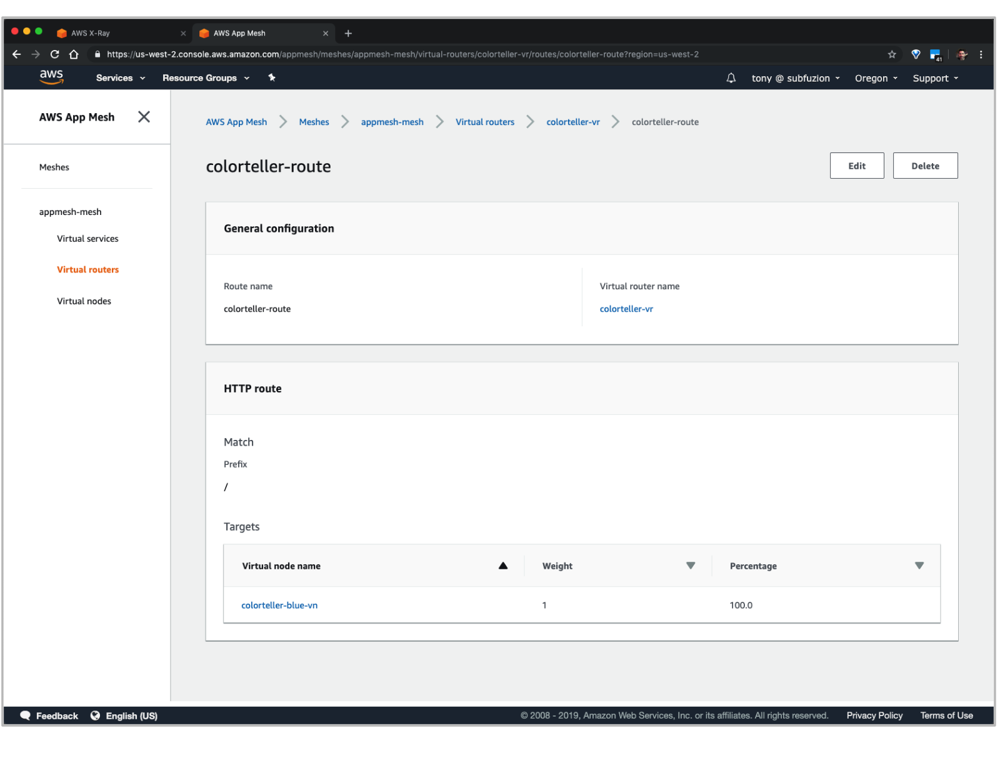
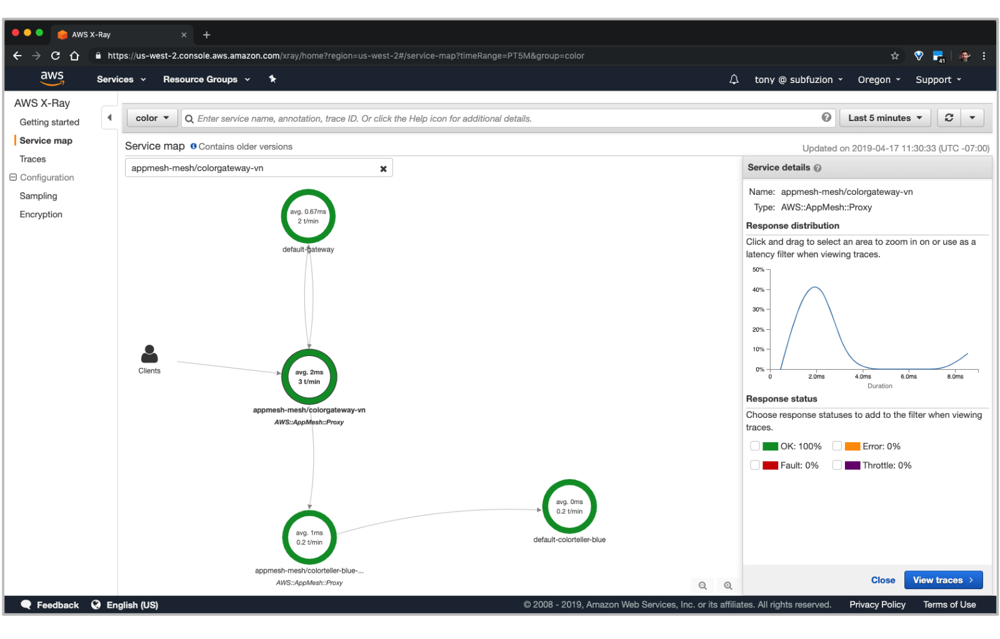

# Using AWS App Mesh with Fargate

## Overview

I gave a walkthrough in my [previous article] on how to deploy a simple microservice application (called the Color App) to ECS and configure [AWS App Mesh] to provide traffic control and observability for it. In this article, we are going to start to explore what it means when we say that App Mesh is a service mesh that lets you control and monitor services spanning different AWS compute environments. We'll start with using Fargate as an ECS launch type to deploy a specific version of our `colorteller` service before we move on and explore distributing traffic across other environments, such as EC2 and EKS.

This is intentionally meant to be a simple example for clarity, but in the real world there are many use cases where creating a service mesh that can bridge different compute environments becomes very useful. This contrived example demonstrates a scenario in which you already have a containerized application running on ECS, but want to shift your workloads to use [Fargate] so that you don't have to manage infrastructure directly. Fargate helps you run containerized tasks using the same ECS primitives as the rest of your application without the need to directly configure EC2 instances.

Our strategy will be to deploy a new version of our `colorteller` service with Fargate and begin shifting traffic to it. If all goes well, then we will shift 100% of our traffic to the new version. For this demo, we'll use "blue" to represent the original version and "green" to represent the new version.

As a refresher, this is what the programming model for the Color App looks like:

<b><i>Figure 1.</i></b> Programmer perspective of the Color App.

In terms of App Mesh configuration, we will want to begin shifting traffic over from version 1 (represented by `colorteller-blue` in the following diagram) over to version 2 (represented by `colorteller-green`). Remember, in App Mesh, every version of a service is backed by actual running code somewhere (in this case ECS/Fargate tasks), so each service will have it's own *virtual node* represenation in the mesh:

<b><i>Figure 2.</i></b> App Mesh configuration of the Color App.

Finally, there is the physical deployment of the application itself to a compute environment. In this demo, `colorteller-blue` runs on ECS using the EC2 launch type and `colorteller-green` will run on ECS using the Fargate launch type. Our goal is to test with a portion of traffic going to `colorteller-blue`, ultimately increasing to 100% of traffic going to this version.

<b><i>Figure 3.</i></b> AWS deployment perspective of the Color App.

## Prerequisites

1. You have successfully set up the prerequisites and deployed the Color App as described in the previous [walkthrough].

## Configuration

### Initial configuration

For the initial configuration, we want 100% of our traffic going to `colorteller-blue`, which represents version 1 of our colorteller service.

Log into the App Mesh console and drill down into "Virtual routers" for the mesh. Configure the HTTP route to send 100% of traffic to the `colorteller-blue` virtual node.

<b><i>Figure 4.</i></b> Routes in the App Mesh console.

Test the service and confirm in X-Ray that the traffic flows through the `colorteller-blue` as expected with no errors.

<b><i>Figure 5.</i></b> Tracing the colorgateway virtual node.

### Deploy the new colorteller to Fargate

For this configuration, we will deploy `colorteller-green`, which represents version 2 of our colorteller service. Initally, we will only send 30% of our traffic over to it. If our monitoring indicates that the service is healthy, we'll increase it to 60%, then finally to 100%. In the real world, you might choose more granular increases with automated rollout (and rollback if issues are indicated), but we're keeping things simple for the demo.

As part of the original [walkthrough] we pushed the `gateway` and `colorteller` images to ECR (see [Deploy Images]). We are going to create a Fargate task using our `colorteller` image and the `envoy` image for App Mesh. When the task is deployed, the running `envoy` container will be a sidecar for the `colorteller` container. A sidecar container will always be co-located on the same physical node (compute resource) and its lifecycle coupled to the lifecycle of the primary application container (see [Sidecar Pattern]).

[A/B testing]: https://en.wikipedia.org/wiki/A/B_testing
[previous article]: ../walkthrough.md
[AWS App Mesh]: https://aws.amazon.com/app-mesh/
[Deploy Images]: https://medium.com/p/de3452846e9d#0d56
[Fargate]: https://aws.amazon.com/fargate/
[Sidecar Pattern]: https://www.oreilly.com/library/view/designing-distributed-systems/9781491983638/ch02.html
[walkthrough]: ../walkthrough.md
[walkthrough prerequisites]: https://medium.com/containers-on-aws/aws-app-mesh-walkthrough-deploy-the-color-app-on-amazon-ecs-de3452846e9d#42cf
